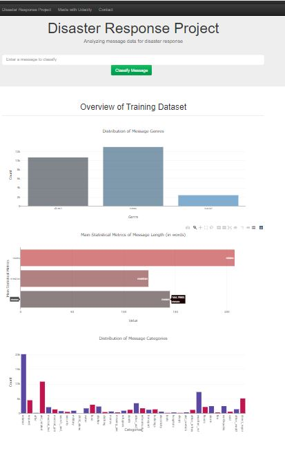

# Disaster Response Pipeline Project

ETL, Machine Learning Pipelines and Flask Web App to classify 20000+ disaster messages on news and social media to 36 different categories.

## Installation

This project requires Python and libraries used in data science, ETL and natural language processing such as:
- pandas
- sqlalchemy
- nltk
- scikit-learn

To easily check the code at the same time as the output, it is recommended to install Anaconda and Jupyter Notebook.

For Web App, the following libraries are required:
- Flask
- Plotly

## Dataset Description

The dataset contains more than 20000 messages sent directly to organizations or via news and social media. It was provided by [Figure Eight](https://www.figure-eight.com/), Udacity's partner on Data Scientist Nanodegree Program.
The messages were labeled and classified into 36 different categories such as: aid related, water, food, storm, etc...

## Project Motivation
The organizations that are responsible for help have least capacity to filter out messages when disaster happens. While it is an emergency to bring people help. This project aims to automatically classify messages sent during disaster in order to notify the concerned organization timely and efficiently.

## File Description
Files are organized as follows:

```
- app
| - template
| |- master.html  # main page of web app
| |- go.html  # classification result page of web app
|- run.py  # Flask file that runs app

- data
|- disaster_categories.csv  # data to process 
|- disaster_messages.csv  # data to process
|- process_data.py
|- DisasterResponse.db   # database to store cleaned data

- models
|- train_classifier.py
|- classifier.pkl  # saved model 

- notebooks
|- ETL Pipeline Preparation.ipynb
|- ML Pipeline Preparation.ipynb

- README.md
```
#### ETL Pipeline:
Raw datasets are stored in data\disaster_categories.csv and data\disaster_messages.csv. After cleaning with data\process_data.py script, dataset is stored in SQL database at data\DisasterResponse.db.
#### Machine Learning Pipeline:
Machine Learning model was created using models\train_classifier.py. This file includes a natural language processing steps to extract useful features from messages and a Random Forest Classifier with Multioutput. It also prints out classification report of 36 categories. Model is then saved as pickle object to models\classifier.pkl.
#### Flask Web App
HTML codes for webpage are stored in app\templates. To run web app, app\run.py is needed. Web App also provides charts showing an overview of training data, including: number of messages per genre, main statistical metrics of messages, and number of messages per category.

Two Jupyter notebooks that were used to create ETL Pipeline and Machine Learning Pipeline production scripts are also available.

## Result Summary
Classification model using Random Forest has average accuracy (f1 score) at 85% over 36 categories. Lowest score is 76%, highest score is 99%.
An overview of web app:



## Licensing, Authors, Acknowledgements
The dataset is available on [Figure Eight](https://www.figure-eight.com/data-for-everyone/) website. It is licensed under a Creative Commons Attribution 4.0 International License.
